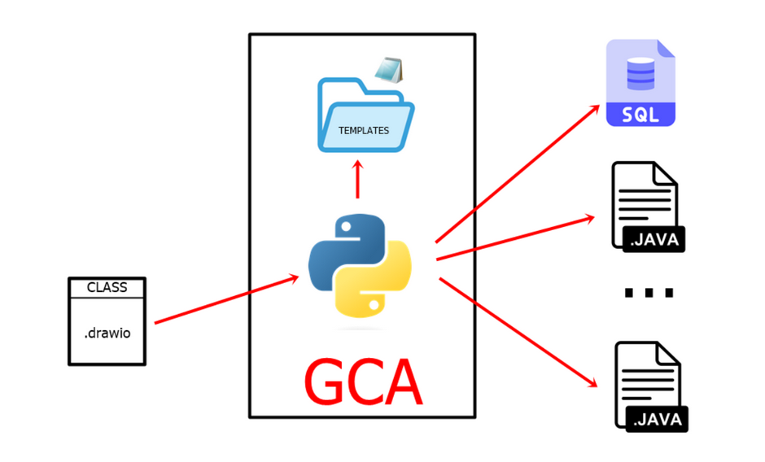

<h1 align="center"> FelipedelosH </h1>
 
<h4>GCA</h4>

 
:construction: Status of project :construction:
 
This is a automate code generator for Java Spring boot. You need create a templates (API, Entity, DAO, UseCases) to generate a automatic code java for springboot.

## :hammer:Funtions:

- `Function 1`: Load a Class Diagram with extension .drawio 
- `Function 2`: Make a AUTOMATIC .sql query to insert all tables to class diagram 
- `Function 3`: Make a AUTOMATIC Entity.java FILE WITH(Constructs, Getters&Setters and toJson) for every entity in class Diagram 
- `Function 3a`: Neque porro quisquam est qui dolorem ipsum quia dolor sit amet. 
- `Function 4`: Neque porro quisquam est qui dolorem ipsum quia dolor sit amet. 

## :play_or_pause_button:How to execute a project

Charge you "classDiagram.drawio" in folder "input" (put the name of file in _PATH_DRAWIO_CLASES_FILE = "input/classDiagram.drawio" in main.py file) execute with Double click in main.py all result files find in "output" folder.

## :hammer_and_wrench:Tech.

- PYTHON
- XML
- DRAW.IO
- output SQL file.
- ourput JAVA file.

## :warning:Warning.

- if you try to use this script in another Spring boot project you need change the tenplates.

## Autor

| [ Andrés Felipe Hernánez](https://github.com/felipedelosh)|
| :---: |