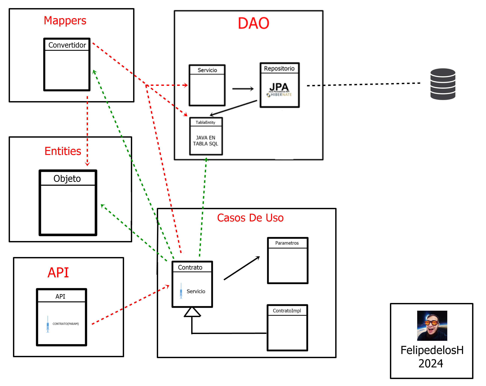

<h1 align="center"> FelipedelosH </h1>
 
<h4>SpringBOOT Blank PROJECT</h4>

 
:construction: ALWAYS IN CONSTRUCTION :construction:
 
This project it´s create like a tool to undertang a concepts: 
* Architecture.
* Code.
* UnitTEST
* API RestFULL

## :hammer:Funtions:

- `Function 1`: Generate al java code with Python GCA (AUTOMATIC-CODE:GENERATE) 
- `Function 2`: Generate API endPoints example: http://localhost:8080/getAllExample 
- `Function 3`: Neque porro quisquam est qui dolorem ipsum quia dolor sit amet. 
- `Function 4`: Neque porro quisquam est qui dolorem ipsum quia dolor sit amet. 
- `Function 5`: Neque porro quisquam est qui dolorem ipsum quia dolor sit amet. 

## Architecture

 
Based in Clean Arquitecture and DDD, two main layers ('domain', 'infraestructure') with single responsability:

1. DOMAIN.ENTITIES: Be a container to database tables with toString like a Json.
2. DOMAIN.USECASES: Be a logic of bussiness.
3. INFRAESTRUCTURE.ENTRYPOINTS: Be a API to conect user with system.
4. INFRAESTRUCTURE.DAO: Be a Datababase conection for every entity via JPA.
5. INFRAESTRUCTURE.MAPPERS: Convert JPA entity to Domain Entity.

## :play_or_pause_button:How to execute a project

Before you need install: java and posgresql 14 (The sql FILE in Docs/sql.sql)
 
In root folder compile with command "./gradlew build"
 
and execute with command "java -jar .\build\libs\demo-0.0.1-SNAPSHOT.jar"

## :play_or_pause_button:Execute unit test

In root folder execute with the command "./gradlew test"

## :hammer_and_wrench:Tech.

- Java
- Gradle
- JPA
- Jakarta
- LOMBOK
- GCA
- CLEAN ARCHITECTURE/DDD
- POSGRESQL 14
- Junit
- Mockito
- Python

## :warning:Warning.

- limitations.

## Autor

| [ Andrés Felipe Hernánez](https://github.com/felipedelosh)|
| :---: |